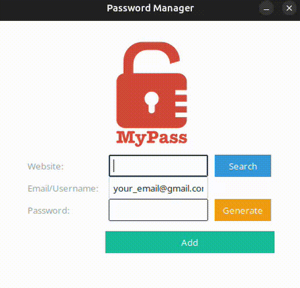

# Simple Password Manager

[](https://www.python.org/)
[](LICENSE)
[](#)

A lightweight password manager built with **Python** and **Tkinter / ttkbootstrap**.
Modernized with a sleek UI and added convenience features while keeping it simple, offline, and secure.

---

## Features

*  **Generate secure random passwords** (letters, numbers, symbols)
*  **Copy passwords directly** to your clipboard
*  **Save website credentials** (email + password) locally in `data.json`
*  **Search for saved accounts** with a popup window

  * Popup shows **Email** and **Password**
  * Includes a **Copy Password** button for convenience
*  **Modern UI** using `ttkbootstrap`

  * Clean color-coded buttons (Search, Generate, Add)
  * Centered logo, with automatic fallback if missing
*  Simple, offline, no accounts, no subscriptions

---

## Screenshots

Here you can add your own screenshots of the app.
Example placeholders:


---

## Demo Video





---

## Getting Started

### Prerequisites

* Python 3.8+
* Install dependencies:

```bash
pip install pyperclip ttkbootstrap
```

### Run the App

```bash
python main_with_JSON.py
```

---

## Data Storage

All credentials are stored in a local `data.json` file in the same directory as the app.

* If the file doesn’t exist, it will be created automatically.
* No cloud storage, no third-party services, your data stays on your machine.

---

## Tech Stack

* **Python**
* **Tkinter / ttkbootstrap** (modern GUI)
* **JSON** (local storage)
* **pyperclip** (clipboard support)

---

## What’s New in This Version

* Modernized **UI** with themed colors, padding, and clean buttons
* **Popup search results** instead of just messagebox

  * Shows email & password
  * Includes **Copy Password** button
* Logo now has a **placeholder** if `logo.png` is missing
* Slight layout improvements for spacing and alignment

---

## Why I Built This

I didn’t want to rely on paid apps or cloud-based managers.
This project is a small, personal tool:

* Not meant to be fancy
* Not packed with unnecessary features
* Just works when you need it

---

## Disclaimer

This project was built for **personal learning and usage**.
It is **not intended for production use** or as a replacement for professional password managers.

## License

This project is licensed under the **MIT License** – see the [LICENSE](LICENSE) file for details.

